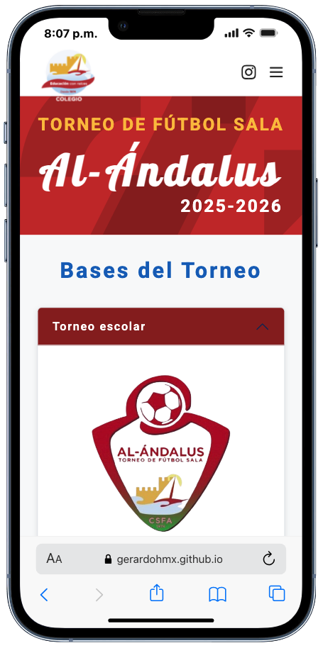
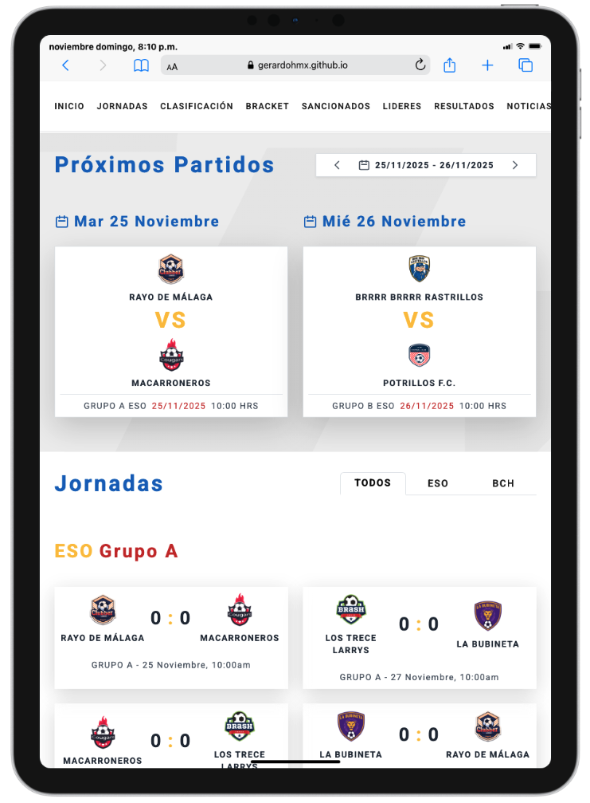
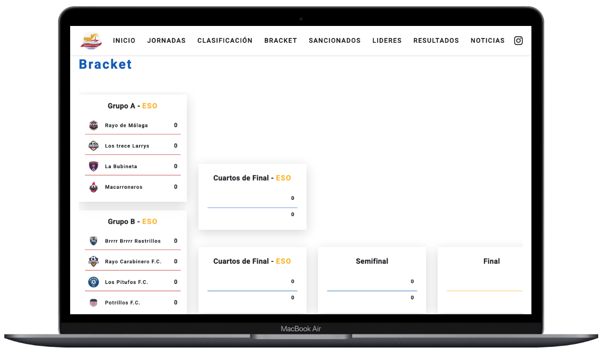
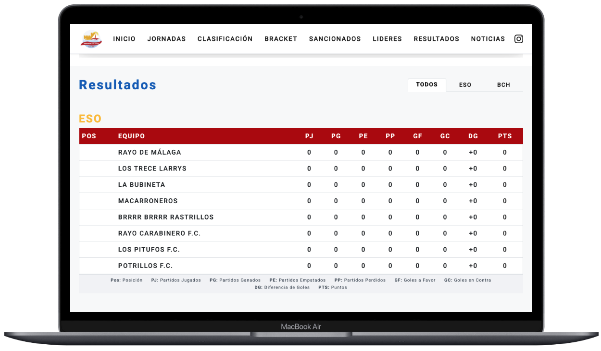
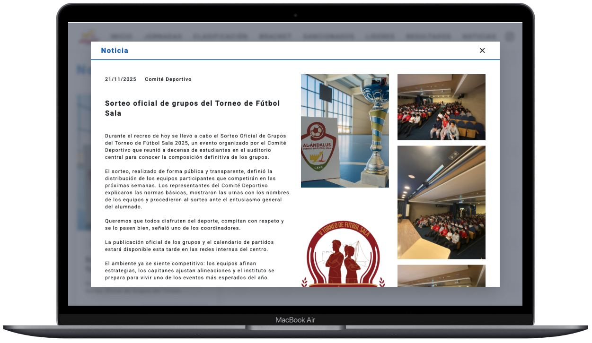

# V Torneo Fútbol Sala Al-Ándalus — Colegio San Francisco de Asís
---
**Autor:** Alumno de 1º Bachillerato Gerardo Huizar Castro
**Proyecto escolar:** V Torneo Fútbol Sala Al-Ándalus
**Tecnologías:** HTML5 · CSS3 · JavaScript (ES6) · Tailwind CSS · Google Sheets CSV

## 📚 Documentación Completa

Para información detallada sobre la arquitectura, funcionamiento y características del proyecto, consulta la documentación completa:

**➡️ [RESUMEN.md](RESUMEN.md)** - Documentación técnica completa del proyecto

La documentación incluye:
- Arquitectura técnica y módulos JavaScript
- Flujo de funcionamiento y gestión de datos
- Sistema de personalización y multilenguaje
- Configuración de Tailwind CSS y variables CSS
- Estadísticas del proyecto y tecnologías utilizadas
- Limitaciones identificadas y soluciones propuestas

---

## Instalación y Compilación

### Requisitos previos
- Node.js y npm instalados

### Instalación de dependencias
```bash
npm install
```

### Compilación de Tailwind CSS

Para compilar el CSS de Tailwind para producción:
```bash
npm run build-css
```

Para compilar y observar cambios en tiempo real (modo desarrollo):
```bash
npm run watch-css
```

El CSS compilado se generará en `dist/output.css` y será utilizado automáticamente por `index.html`.  

---

https://gerardohmx.github.io/TorneoAl-Andalus/

---

| Torneo | Próximos partidos | Bracket |
|----------|----------|----------|
|  |  |  |

| Resultados | Noticias |
|----------|----------|
|  |  |

